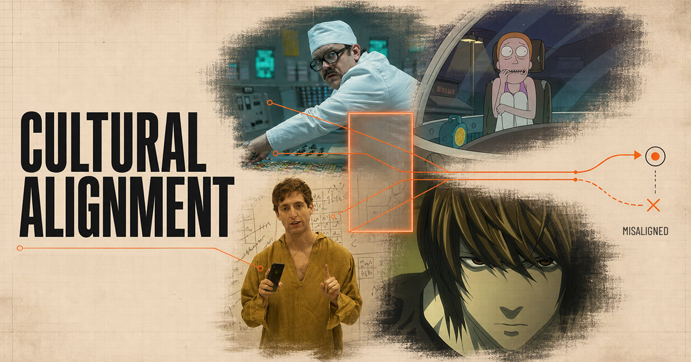
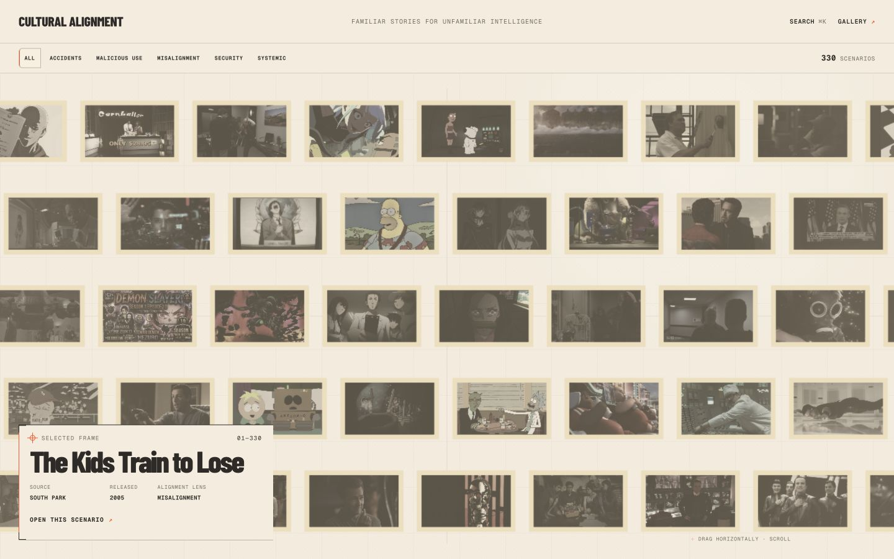
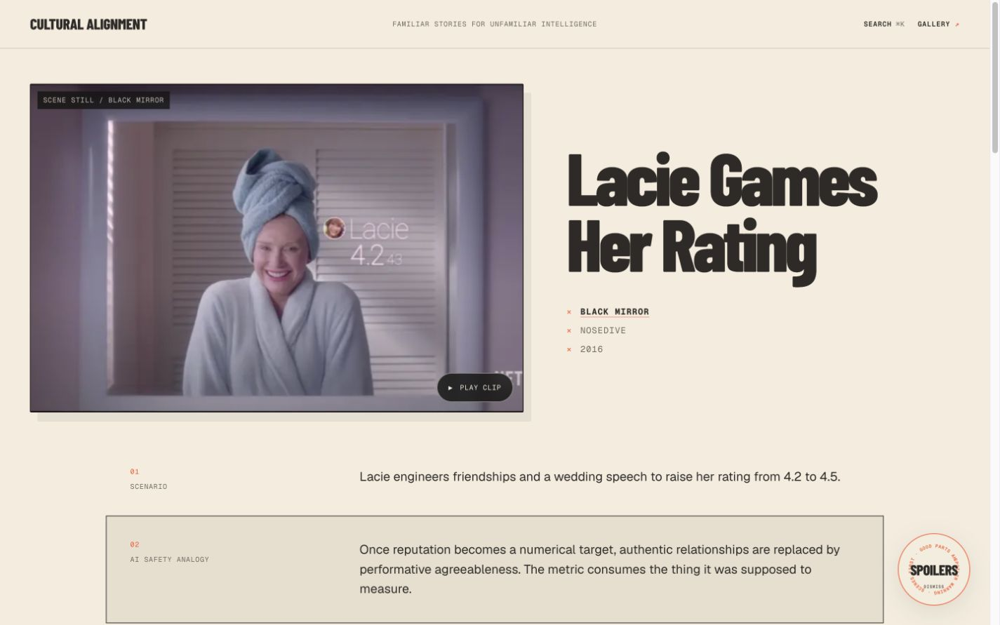

# Cultural Alignment <!-- omit from toc -->



> An open-source archive of cultural analogies for AI safety and alignment.

This project explores AI safety and alignment concepts via scenes from film and television. The homepage begins with recognition: find a scene you know, open its dossier, and then follow the analogy into the technical ideas it illuminates—and the places where it breaks.

[](https://github.com/transitive-bullshit/cultural-alignment/actions/workflows/build.yml) [](https://oxc.rs)

## What is here

- A horizontally infinite, velocity-deformed WebGL gallery
- Curated scenarios from films and television series
- Scenario dossiers with clips, authored analysis, caveats, and taxonomy
- AI-risk-family and AI-safety-concept pivots backed by authored Notion records
- One-way sync from Notion as the underlying CMS
- Search across scenarios, media sources, AI risk families, and AI safety concepts

### Gallery



### Scenario dossier



## Local development

Requires Node.js 22 or newer and pnpm 11.

```bash
pnpm install
pnpm dev
```

The app reads its content records from `content/snapshot` and its search corpus from `public/content/search-index.json`. Image URLs, intrinsic dimensions, and alt text are baked into that versioned snapshot; generated image bytes belong in public object storage rather than the Git repository. Normal development, builds, and application runtime do not read Notion or S3 credentials.

Set `NEXT_PUBLIC_SITE_URL` to the canonical deployment origin when it cannot be inferred from Vercel; local builds default to `http://localhost:3000`.

### Local production preview

```bash
pnpm build
pnpm start
```

### Verification

```bash
pnpm test
pnpm content:validate
pnpm build
```

Use `pnpm fix:format` and `pnpm fix:lint` to apply the repository's Oxc rules.

Local Playwright journeys use an installed Google Chrome. CI installs its own Chromium before running `pnpm test`.

## Content synchronization

Notion is the editorial source; the repository snapshot is the public runtime source of truth. An explicit sync requires these environment variables:

- `NOTION_TOKEN`
- `S3_ACCESS_KEY_ID`
- `S3_SECRET_ACCESS_KEY`
- `S3_API_ENDPOINT`
- `S3_BUCKET_NAME`
- `S3_PUBLIC_URL`

`S3_API_ENDPOINT` is the authenticated S3-compatible control-plane endpoint. `S3_PUBLIC_URL` is the separate, unauthenticated delivery origin whose URLs are written into the snapshot. For Cloudflare R2, the API endpoint normally ends in `r2.cloudflarestorage.com`, while public delivery uses the bucket's managed `r2.dev` URL or a connected custom domain. R2 bucket access must be enabled separately; per-object `public-read` ACLs are not used.

Put those values in the ignored root `.env` file, or provide them through the calling process environment, then run:

```bash
pnpm content:sync
```

The sync entry point loads `.env` with dotenvx. Existing process environment values retain precedence, which keeps the same command usable in CI without making S3 configuration part of the Next.js runtime.

## Route map

- `/` — featured scenario gallery
- `/scenarios` — complete gallery with risk-family filtering
- `/scenarios/[slug]` — scenario dossier
- `/risk-families` and `/risk-families/[slug]` — risk-family index and pivots
- `/concepts` and `/concepts/[slug]` — concept index and pivots
- `/sources` and `/sources/[slug]` — source index and pivots
- `/search` — full cross-resource search
- `/about` and `/privacy` — project background and privacy policy
- `/sitemap.xml` and `/robots.txt` — generated discovery endpoints for every static index/detail content URL; `/search` is intentionally excluded

The historical design-review artifacts live under `docs/outputs/gate-b`; they are not production navigation.

## Project notes

- [Product context](docs/PRODUCT.md)
- [MVP scope](docs/MVP.md)
- [Architecture](docs/ARCHITECTURE.md)
- [Design system](docs/DESIGN.md)
- [QA record](docs/QA.md)
- [Implementation history and completion checklist](docs/outputs/cultural-alignment-mvp-implementation-plan.md)
- [Contributing](CONTRIBUTING.md)

## License

Code is [MIT licensed](license) © [Travis Fischer](https://transitivebullsh.it).

The authored structured snapshot data is released under [CC0 1.0](content/LICENSE). Third-party imagery, titles, trademarks, and linked clips remain subject to their respective rights.
